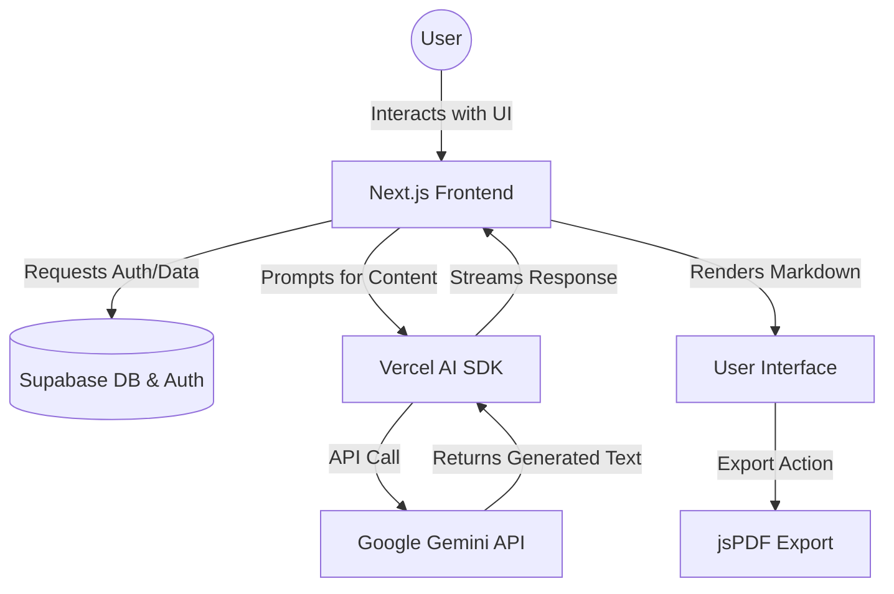

<div align="center">

# 🤖 AI Content Creator

**Next-Generation AI-Powered Content Generation Platform**

[Explore Live Demo](#) <!-- Replace with live link -->
[](https://nextjs.org/)
[](https://reactjs.org/)
[](https://www.typescriptlang.org/)
[](https://tailwindcss.com/)
[](https://supabase.com/)
[](https://ai.google.dev/)


An intelligent, full-stack application that leverages Google's Gemini AI to generate, manage, and export high-quality content, built for creators who demand speed and precision.

</div>

---

## 🧐 What it does
**AI Content Creator** is a modern web application designed to streamline the content creation process. Whether you need blog posts, marketing copy, or technical documentation, the app uses advanced AI (Google Gemini) to generate structured, high-quality text. It features robust user authentication and data persistence via Supabase, seamless Markdown rendering, PDF exports, and a beautiful, responsive UI powered by Tailwind CSS and Framer Motion.


---

## ✨ Key Features

- 🧠 **AI-Powered Generation**: Leverage the power of Google Gemini to generate human-like text and content instantly.
- 🔐 **Secure Authentication**: Complete auth flows and user management powered by Supabase.
- 🎨 **Beautiful UI/UX**: Fluid animations (Framer Motion), dark mode support (next-themes), and responsive design (Tailwind CSS).
- 📄 **Rich Text & Markdown**: Fully supports Markdown rendering for generated content.
- 📥 **Export to PDF**: Instantly export your generated content into polished PDF documents (`jspdf`).
- 📊 **Data Visualization**: Integrated charts and analytics utilizing `recharts`.
- ⚡ **High Performance**: Built on Next.js App Router for optimal speed and SEO.


---

## 🏗️ Architecture & Workflow



**Workflow Breakdown**:
1. **👩‍💻 User Interaction**: Users log in (via Supabase) and input their content requirements.
2. **🤖 AI Processing**: The app uses `@ai-sdk/google` to stream requests to the Gemini API.
3. **⚡ Real-time Rendering**: The response is streamed back to the Next.js frontend and rendered dynamically using `react-markdown`.
4. **💾 Storage & Export**: Users can save their content to the Supabase database or export it directly as a PDF.

---

## 📂 Folder Structure

A well-organized Next.js App Router architecture:

```text
ai-content-creator/
├── app/                  # Next.js 15+ App Router files (Pages, Layouts, API routes)
├── components/           # Reusable React components (UI, Forms, Layout)
├── utils/                # Helper functions, Supabase clients, and utilities
├── public/               # Static assets (images, fonts, icons)
├── middleware.ts         # Edge middleware for route protection & auth
├── package.json          # Project dependencies and scripts
└── tailwind.config.ts    # Tailwind CSS configuration
```

---

## 🚀 Setup & Deployment

Follow these steps to get the project running locally.

### 1. Prerequisites
- Node.js 18.x or later
- npm, yarn, pnpm, or bun
- A Supabase account
- A Google Gemini API Key

### 2. Clone the repository
```bash
git clone https://github.com/Santhoshcv07/AI-Content-Creator.git
cd AI-Content-Creator
```

### 3. Install dependencies
```bash
npm install
# or yarn install / pnpm install
```

### 4. Environment Variables
Create a `.env.local` file in the root directory and add the following:

```env
# Google Gemini
GOOGLE_GENERATIVE_AI_API_KEY=your_gemini_api_key

# Supabase
NEXT_PUBLIC_SUPABASE_URL=your_supabase_project_url
NEXT_PUBLIC_SUPABASE_ANON_KEY=your_supabase_anon_key
```

### 5. Run the development server
```bash
npm run dev
```
Navigate to `http://localhost:3000` to see the application in action.

### 6. Deployment
This project is optimized for deployment on **Vercel**. 
1. Push your code to GitHub.
2. Import the repository into Vercel.
3. Add your environment variables in the Vercel dashboard.
4. Click **Deploy**.

---

## 💡 Use Cases

- **Digital Marketers**: Instantly generate ad copy, social media captions, and email newsletters.
- **Bloggers & Writers**: Overcome writer's block by generating article outlines and full drafts.
- **Developers**: Automate the creation of technical documentation and READMEs.
- **Educators & Students**: Generate study guides, quizzes, and summaries of complex topics.


---

## 🔮 Future Scope


---

## 🤝 Contribution

Contributions make the open source community such an amazing place to learn, inspire, and create. Any contributions you make are **greatly appreciated**.

1. Fork the Project
2. Create your Feature Branch (`git checkout -b feature/AmazingFeature`)
3. Commit your Changes (`git commit -m 'Add some AmazingFeature'`)
4. Push to the Branch (`git push origin feature/AmazingFeature`)
5. Open a Pull Request

---

<div align="center">
  <p>Built with ❤️ by <a href="https://github.com/Santhoshcv07">Santhoshcv07</a></p>
</div>
